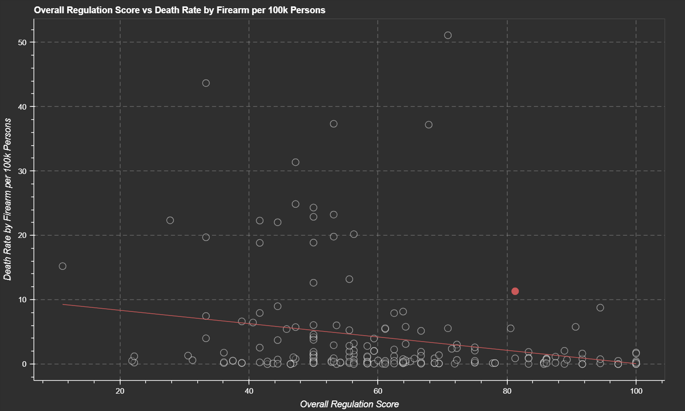

# Gun Violence Correlations

This project explores the correlations between gun violence, gun ownership, and gun legislation by country, leveraging data from [Wikipedia](https://en.wikipedia.org/wiki/Overview_of_gun_laws_by_nation) and the [Small Arms Survey](https://smallarmssurvey.org/). The project was also deployed to [Heroku](https://gun-violence-correlations.herokuapp.com/main) and includes the necessary files to deploy it yourself if desired. This was completed as part of Code Louisville's May 2022 Data Analysis 2 course.

## Requirements
- Python 3.10.2
- an internet connection

## Setup
- Run `git clone https://github.com/richard-oden/gun-violence-correlations.git` to clone the repository.
- In the instaprices directory, run `python3 -m venv venv` to create the virtual environment.
- Activate the newly created virtual environment. From the instaprices directory run the following command:
    - if using Windows PowerShell: `venv\Scripts\Activate.ps1`
    - if using Linux or Mac with bash/zsh: `venv/bin/activate`
    - (if you're still having trouble, see [this](https://docs.python.org/3/library/venv.html) and [this](https://itnext.io/a-quick-guide-on-how-to-setup-a-python-virtual-environment-windows-linux-mac-bf662c2c77d3) for help.)
- Run `pip install -r requirements.txt` to install the required packages.

## Instructions
- To run the project locally, run the following command from the project root directory: `bokeh serve --show src `. The visualization should then appear in your browser. From there, you can interact with the select elements to choose what data is displayed, and hover over individual countries to see more information.
- After starting the project, you can access log files by navigating to `http://localhost:5006/src/static/logs/2022-07-27_log.txt`, replacing the date with the current date. Logs are retained for previous days as well. (Note the port number after `localhost` may be different. Enter the port number as it appears in your browser.)
- (Optional) To deploy the project to Heroku, first ensure that you have the Heroku CLI installed and a Heroku app created. After logging in through the Heroku CLI, run `heroku git:remote -a APP_NAME`, then `git push heroku main`. Replace `APP_NAME` with your Heroku app's name. If you're still stuck, check out [this tutorial](https://medium.com/@jodorning/how-to-deploy-a-bokeh-app-on-heroku-486d7db28299).
    - Note that the logs are inaccessible in Heroku, because server storage is ephemeral and immutable. This is something I want to fix int he future though. Probably by hosting them on an S3 Bucket or something similar.

## Feature Requirements

### 1. Loading data
- Read TWO data files (JSON, CSV, Excel, etc.)
    - In src/helpers/data_helper.py, see `get_gun_deaths_df` (line 81), `get_civilian_guns_df` (line 117), `get_military_guns_df` (line 156), and `get_police_guns_df` (line 201).
- Scrape TWO pieces of data from anywhere on the internet and utilize it in your project.
    - I actually only scraped one piece of data, but see `gun_gun_laws_df` (line 243) in src/helpers/data_helper.py.

### 2. Clean and operate on data while combining them
- Clean your data and perform a pandas merge with your two data sets, then calculate some new values based on the new data set.  
    - In src/helpers/data_helper.py, see `clean_gun_deaths_df` (line 92), `clean_civilian_guns_df` (line 128), `clean_military_guns_df` (line 167), `clean_police_guns_df` (line 212), and `clean_gun_laws_df` (line 243). Also see lines 72-75 to see the pandas merge, in `get_cleaned_data`.

### 3. Visualize / present your data
- Make a visualization with Bokeh.
    - See src/helpers/visualization_helper.py, particularly `initialize_bokeh` (line 11) and `create_plot` (line 45).

### 4. Best practices
- Utilize a virtual environment and include instructions in your README on how the user should set one up.
    - See Instructions section above.
- Add logging.
    - See src/helpers/log_helper.py. Logs are created and stored in src/static/logs. (The project must be run at least once for any logs to appear)

### 5. Interpretation of your data
- Annotate your .py files with well-written comments and a clear README.md
    - Lots of comments in data_helper.py and visualization_helper.py, in src/helpers. There are also plenty of docstrings.